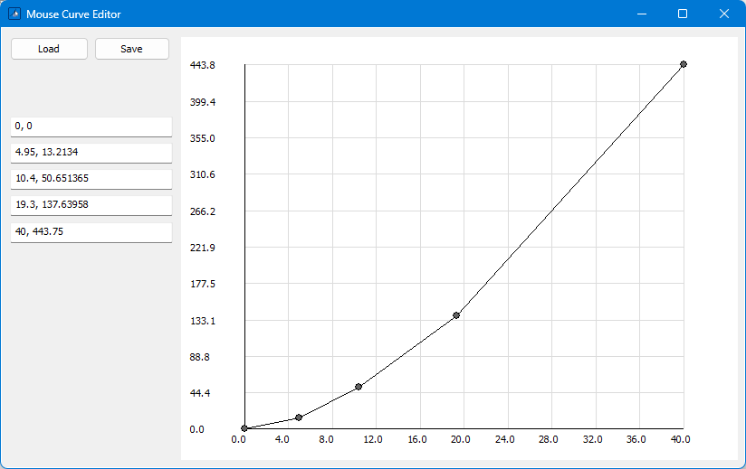

Mouse Curve Editor
==================

Allows viewing and editing the mouse acceleration curve defined by the following registry entries:

```
[HKEY_CURRENT_USER\Control Panel\Mouse]
"SmoothMouseXCurve"
"SmoothMouseYCurve"
```



Note: In order for changes to take effect, you must log out and back in again.